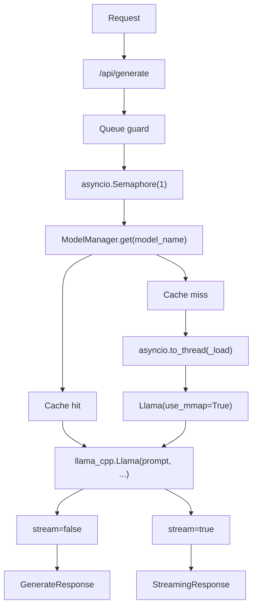

# AirPI: LLM Inference Server for Raspberry Pi 5

> Ollama-compatible inference server built on `llama-cpp-python` for a Raspberry Pi 5 with 8 GB RAM and NVMe storage.

[](https://www.python.org/)
[](https://github.com/ggerganov/llama.cpp)
[](https://fastapi.tiangolo.com/)
[](https://www.freedesktop.org/wiki/Software/systemd/)
[](https://github.com/ollama/ollama)

## Why AirPI

| Signal | Value |
| --- | --- |
| Target hardware | Raspberry Pi 5, 8 GB RAM, NVMe SSD |
| Runtime | Direct `llama-cpp-python`, no daemon layer |
| API shape | Ollama-compatible |
| Queue policy | `Semaphore(1)` for stable ARM throughput |
| Model strategy | mmap-backed loading for larger GGUF files |
| Service mode | systemd native |

## What It Delivers

| Capability | AirPI |
| --- | --- |
| 7B GGUF support | Yes |
| 14B GGUF support | Yes, via mmap paging |
| Keep-alive tuning | Yes |
| Session KV cache | Yes |
| Speculative decoding | Yes, optional |
| Local-only binding | Yes, `127.0.0.1:11435` by default |

## Performance Envelope

| Model | RAM | tok/sec |
| --- | --- | --- |
| Qwen2.5-Coder 1.5B Q4_K_M | 1.2 GB | 10 to 15 |
| Qwen2.5-Coder 3B Q4_K_M | 2.5 GB | 6 to 10 |
| Qwen2.5-Coder 7B Q4_K_M | 4.1 GB | 2 to 4 |
| Qwen2.5-Coder 14B Q4_K_M | 8.1 GB | 1 to 2 with mmap on NVMe |

## Architecture



## Runtime Contract

**Why `Semaphore(1)`?**  
The Pi 5 has four ARM Cortex-A76 cores. One LLM call already uses all available CPU headroom efficiently. Two parallel calls would split the threads and reduce throughput for both requests.

**Why `use_mmap=True`?**  
Large GGUF models can stay usable on an 8 GB Pi when the operating system pages less active layers to NVMe.

**Why AirPI instead of Ollama?**  
AirPI keeps the same API shape but gives tighter control over cache reuse, queueing, speculative decoding, and model recovery.

## Install

### 1. Create the Python environment

```bash
cd /home/alex/AirPI
python3 -m venv .venv
source .venv/bin/activate
```

### 2. Build `llama-cpp-python` for ARM64

```bash
CMAKE_ARGS="-DLLAMA_NATIVE=on -DLLAMA_BLAS=OFF" \
  pip install llama-cpp-python --no-binary llama-cpp-python
```

### 3. Install dependencies

```bash
pip install -r requirements.txt
```

### 4. Download models

```bash
sudo mkdir -p /data/models
sudo chown pi:pi /data/models

pip install huggingface_hub
huggingface-cli download Qwen/Qwen2.5-Coder-1.5B-Instruct-GGUF \
  qwen2.5-coder-1.5b-instruct-q4_k_m.gguf \
  --local-dir /data/models

huggingface-cli download Qwen/Qwen2.5-Coder-7B-Instruct-GGUF \
  qwen2.5-coder-7b-instruct-q4_k_m.gguf \
  --local-dir /data/models
```

## Run

### Local test

```bash
source .venv/bin/activate
uvicorn server:app --host 127.0.0.1 --port 11435
```

### systemd

```bash
sudo cp systemd/airpi.service /etc/systemd/system/
sudo systemctl daemon-reload
sudo systemctl enable --now airpi
sudo systemctl status airpi
```

## Verify

```bash
curl http://localhost:11435/health
curl http://localhost:11435/api/tags
curl -X POST http://localhost:11435/api/generate \
  -H "Content-Type: application/json" \
  -d '{
    "model": "qwen2.5-coder-1.5b-q4_k_m.gguf",
    "prompt": "Was ist 2+2?",
    "stream": false
  }'
```

## PI Guardian Integration

Set the router base URL to AirPI:

```bash
OLLAMA_BASE_URL=http://127.0.0.1:11435
```

AirPI stays API-compatible with Ollama, so no router rewrite is required.

## Configuration

| Variable | Default | Meaning |
| --- | --- | --- |
| `AIRPI_MODELS_DIR` | `/data/models` | GGUF model directory |
| `AIRPI_DEFAULT_MODEL` | `qwen2.5-coder-1.5b-q4_k_m.gguf` | Default model |
| `AIRPI_LARGE_MODEL` | `qwen2.5-coder-7b-q4_k_m.gguf` | Large prompt model |
| `AIRPI_N_THREADS` | `4` | CPU threads |
| `AIRPI_N_CTX_SMALL` | `4096` | Small model context |
| `AIRPI_N_CTX_LARGE` | `2048` | Large model context |
| `AIRPI_MMAP` | `true` | Use mmap paging |
| `AIRPI_MLOCK` | `false` | Keep model locked in RAM |
| `AIRPI_MAX_QUEUE` | `10` | Max queued requests |
| `AIRPI_KEEP_ALIVE_TIMEOUT` | `900` | Model idle timeout in seconds |
| `AIRPI_HOST` | `127.0.0.1` | Bind address |
| `AIRPI_PORT` | `11435` | HTTP port |

## Notes

- The server logs loaded models and active sessions on `/health`.
- The retry path handles recoverable broadcast and shape mismatch failures in `llama_cpp`.
- The service unit is designed for a local-only Pi deployment.
